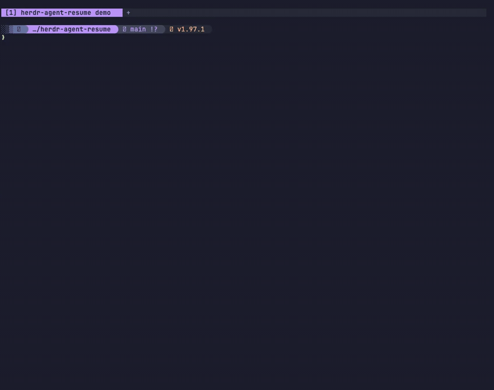

# Herdr Agent Resume

A [Herdr](https://herdr.dev) plugin that inserts or copies the latest agent
resume command printed in the focused pane after an agent exits. OpenCode,
Codex, Claude Code, and Factory Droid are currently supported.



## Motivation

Agent CLIs print exact commands for returning to completed terminal sessions,
but manually selecting long session identifiers is slow and error-prone. This
plugin finds the newest supported resume command in the focused pane and either
inserts it at the shell prompt for review or copies it on explicit request. It
never executes the command automatically.

The plugin searches the focused pane's retained Herdr scrollback and selects the
newest command that matches a supported agent's exit message:

```text
opencode -s ses_...
codex resume 019f88e3-...
claude --resume b3dbde41-...
droid --resume droid-session-id
```

If commands from multiple agents are present, the command that appears latest
in the pane output is selected.

## Requirements

- Herdr 0.7.5 or newer
- macOS or Linux on Intel/AMD64 or ARM64
- `curl` or `wget`
- `sha256sum` or `shasum`
- Linux copy action only: `wl-copy`, `xclip`, or `xsel`

Installation downloads the exact versioned binary for the current platform from
GitHub Releases and verifies it against `SHA256SUMS` before atomically replacing
the installed binary. Rust and Cargo are not required.

Supported release targets are:

```text
aarch64-apple-darwin
x86_64-apple-darwin
aarch64-unknown-linux-musl
x86_64-unknown-linux-musl
```

The plugin has been tested end to end in a live Herdr session only on macOS.
CI builds and tests the Linux targets, but their runtime behavior has not been
manually verified.

## Install

```bash
herdr plugin install Angel-O/herdr-agent-resume
```

Add the keybindings to `~/.config/herdr/config.toml`:

```toml
[[keys.command]]
key = "prefix+a"
type = "plugin_action"
command = "angel-o.agent-resume.insert-resume"
description = "insert agent resume command"

[[keys.command]]
key = "prefix+shift+a"
type = "plugin_action"
command = "angel-o.agent-resume.copy-resume"
description = "copy agent resume command"
```

Reload the configuration:

```bash
herdr server reload-config
```

After exiting a supported agent, press the Herdr prefix followed by `A` to insert
the full command at the shell prompt without executing it. Use `prefix+shift+a`
to copy it to the clipboard instead. The resume command does not need to remain
visible on screen, but its output must still be retained in Herdr's scrollback.

## Local Setup

Local development requires Rust 1.89 or newer and Cargo. Build and link the
plugin from this directory:

```bash
cargo build --release
herdr plugin link "$PWD"
```

## Development

```bash
cargo fmt --check
cargo test --all-targets --locked
cargo clippy --all-targets --all-features --locked -- -D warnings
RUSTDOCFLAGS="-D warnings" cargo doc --no-deps --document-private-items --locked
scripts/check-version.sh
scripts/test-install.sh
```

Release maintainers should follow [RELEASING.md](RELEASING.md).

## Remote Sessions

Direct insertion should work in remote sessions because Herdr sends the text to
the server-side pane. Clipboard copies should happen on the Herdr server. When
you attach to a remote server, the copy action is therefore expected to update
the remote machine's clipboard, not the clipboard on the computer you are
attaching from. Herdr's plugin API does not currently provide access to the
attaching computer's clipboard. This behavior has not been tested end to end.

## Contributing

Contributions are welcome. See [CONTRIBUTING.md](CONTRIBUTING.md) for development
setup, project conventions, and required checks.

## License

[MIT](LICENSE)
